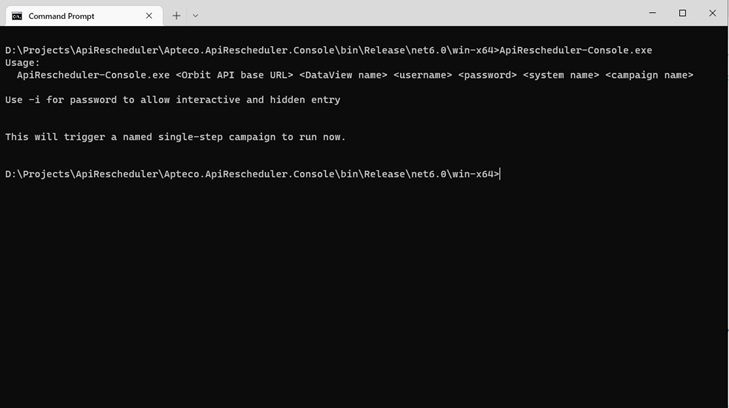
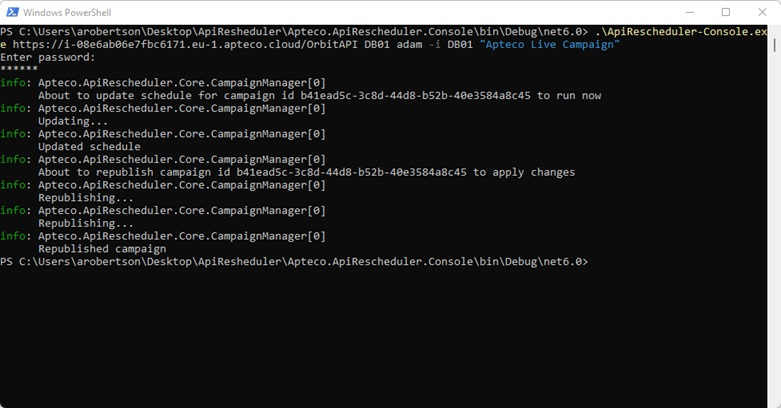

# ApiRescheduler
This is a very simple application that connects to the Apteco API and updates the schedule for the named campaign to run 
immediately.  Campaigns can have been created in [Apteco PeopleStage™](https://www.apteco.com/products/apteco-peoplestage)
or [Apteco Orbit™](https://www.apteco.com/products/apteco-orbit), but must just have a single step with a schedule on the
audience.  This application could be adapted to control schedules in more detail or to change other aspects of a campaign.

### Background
Apteco PeopleStage™ is part of the [Apteco](http://www.apteco.com) marketing software suite.  It provides a platform to
create, manage, and automate multi-channel, multi-stage, event-driven marketing communications and personalised campaigns.  Apteco Orbit™ now also provides access to the same campaigning engine.

The Apteco API provides programmatic access to information held in an Apteco FastStats® database, as
well as reporting information generated from Apteco PeopleStage™ and Apteco Orbit™.  It now also has the ability to control
campaigns created in these tools.

The ApiRescheduler is a sample application that connects to the campaigns held in the Apteco system via the
Apteco API to demonstrate how they can be updated.

### Usage
To use the ApiRescheduler, download the latest release from [GitHub](https://github.com/Apteco/ApiRescheduler/releases)
or build the software via Visual Studio or the .Net Core CLI (see [below](#Build)).

To find out what command line parameters are required, run the console application with no parameters:



You will need various pieces of information:

* The name of a DataView to connect to and a valid username and password for that DataView
* The name of a system inside that DataView that has campaigns.
* The name of a campaign to reschedule.



### What the API Rescheduler does

When you use the API Rescheduler to set a campaign to run now it runs through the following steps:

1. Logs in to the API at the specified URL
2. Looks up all campaigns with the given name.  If no campaigns exist with that name or if there are more than
one then an error is returned.
3. Gets the id of that campaign and uses it to create a job to update its schedule set to run now.  It then waits for this
job to complete.
4. Creates a second job to re-publish the campaign to make the schedule live.  Again, it waits for this job to complete.

### Implementation
* To see how the ApiClient code was generated from the API's Swagger specification, look at the
Readme in the [Apteco.ApiRescheduler.ApiClient](Apteco.ApiRescheduler.ApiClient) project.

* The [Apteco.ApiRescheduler.Core](Apteco.ApiRescheduler.Core) project contains the business logic for the
application (as described above).

* The [Apteco.ApiRescheduler.Console](Apteco.ApiRescheduler.Console) project contains a console application
entry point that simply gathers the command line parameters and starts the processing.

### Build
To build the project, either do so via Visual Studio (2022 or later) or using the dotnet CLI tool.

##### Visual Studio
Open the ApiRescheduler.sln file in Visual Studio and build the project.

To generate the standalone executable, right-click on the Apteco.ApiRescheduler.Console project and choose "Publish...".
Then choose the "Folder Profile" and publish that.  The binaries will be compiled into
`Apteco.ApiRescheduler.Console\bin\Release\net6.0\win-x64`

##### dotnet CLI
To build the project so that it will run under any archirecture that .Net Core supports (Windows, Mac OSX, Linux), go to the
root directory and run `dotnet build`.  This will compile the code so that it can be run using the commands:

```
cd Apteco.ApiRescheduler.Console\bin\Debug\net6.0
dotnet ApiRescheduler-Console.dll
```

To build a .exe file that will run on the Windows 64 bit platform, go to the root directory and run 
```
dotnet publish -c Release -r win-x64
```

The binaries will be compiled into
`Apteco.ApiRescheduler.Console\bin\Release\net6.0\win-x64`
